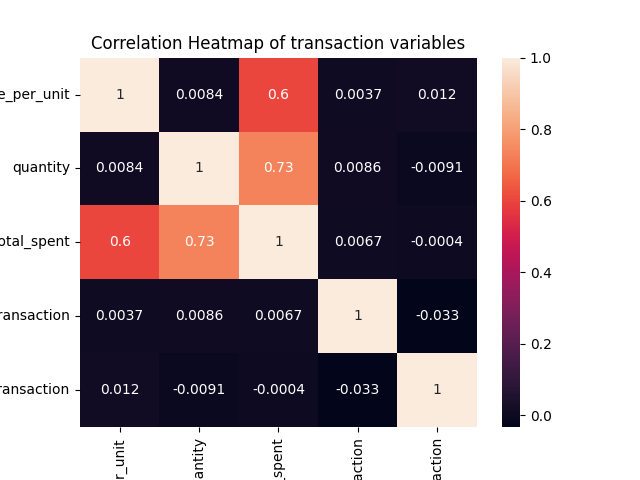
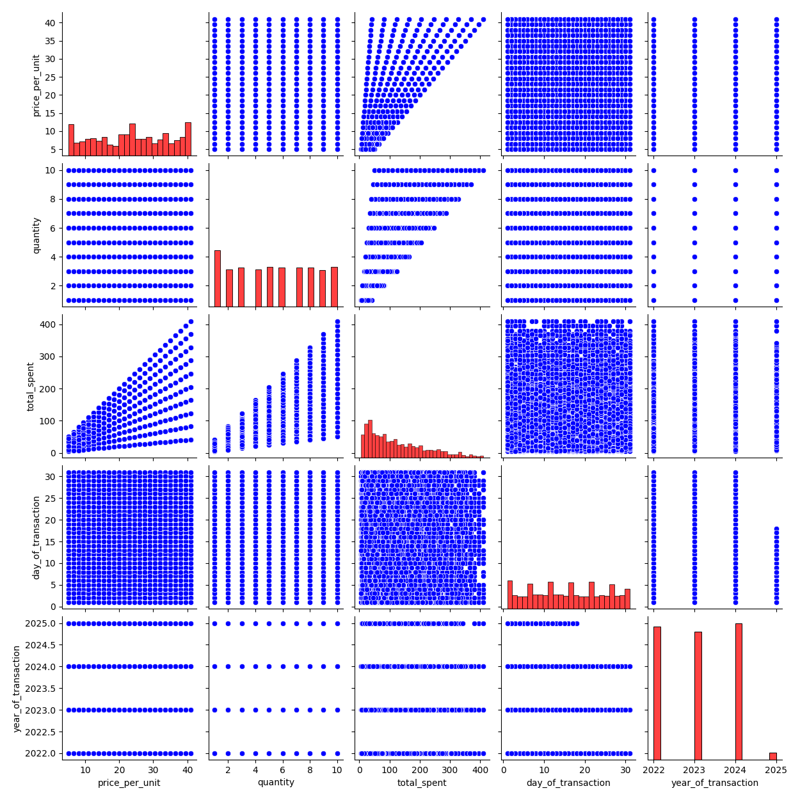
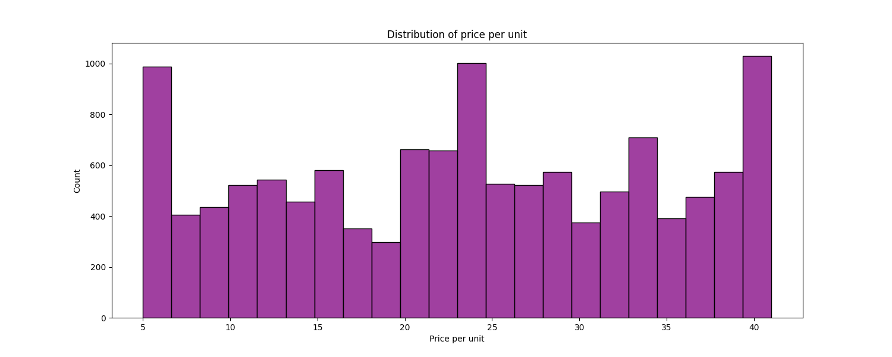
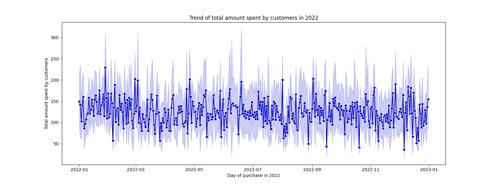
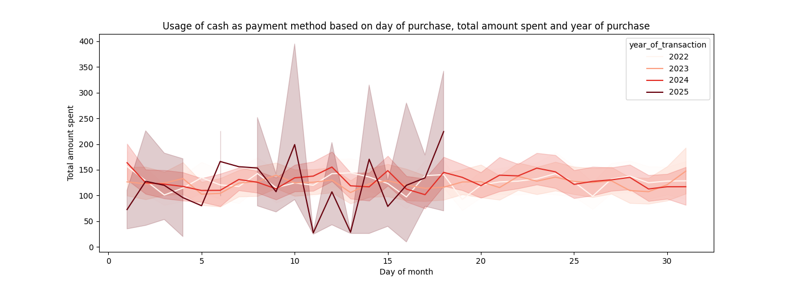
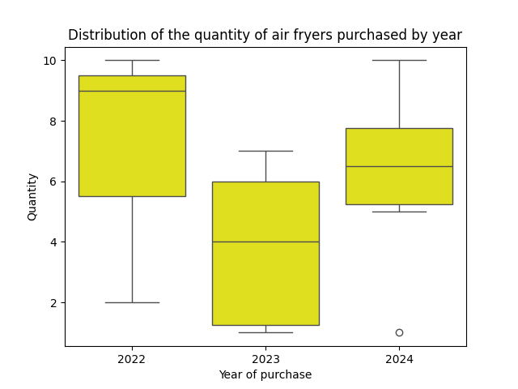
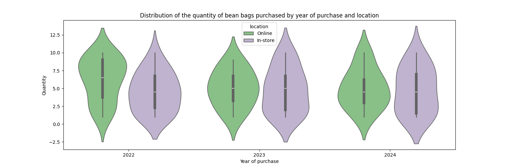

# Data analysis of Retail store sales

  
  
  
  

## Dataset🗂️
- Source: Kaggle 
- Source url: https://www.kaggle.com/datasets/ahmedmohamed2003/retail-store-sales-dirty-for-data-cleaning

## Kaggle Notebook📓
https://www.kaggle.com/code/reshmaharidhas/data-cleaning-eda-analysis-of-retail-store

## Tech stack💻
- Pandas
- Seaborn
- Matplotlib
- Python
- Numpy

## Visualizations💻

## License💻
MIT
